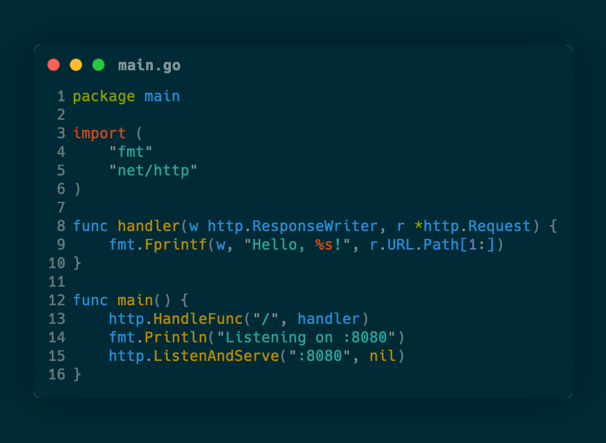
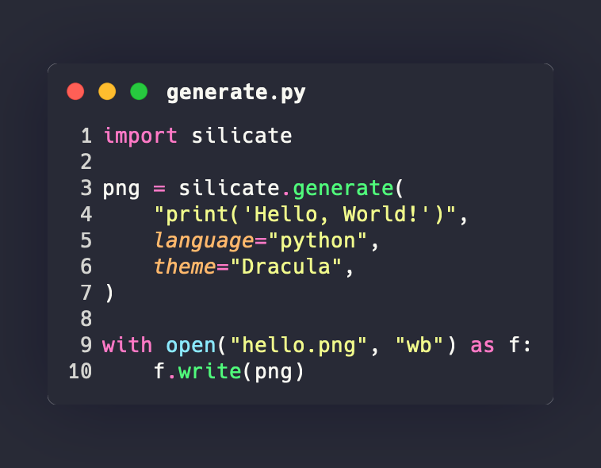
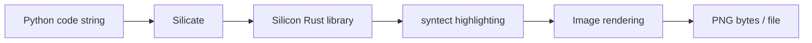

# Silicate

**Python bindings for [Silicon](https://github.com/Aloxaf/silicon)'s renderer — create beautiful images of your source code, powered by Rust.**

<p align="center">
  
</p>

Unlike wrapper approaches that shell out to a CLI, Silicate uses [PyO3](https://pyo3.rs) to call Silicon's Rust library directly, giving you native performance with a clean Python API.

## Features

- **Native Rust performance** — no subprocess overhead, no CLI dependency
- **Rich customization** — themes, fonts, shadows, line highlighting, window controls
- **24 built-in themes** — Dracula, Nord, Monokai, Solarized, and more
- **180+ languages** — powered by syntect's syntax highlighting engine
- **Type-safe API** — full type stubs for IDE autocompletion
- **Returns bytes or saves to file** — integrate into any workflow

## Quick start

```python
import silicate

# Generate PNG bytes
png = silicate.generate(
    "print('Hello, World!')",
    language="python",
    theme="Dracula",
)

# Save directly to a file
silicate.to_file(
    "fn main() { println!(\"Hello!\"); }",
    "output.png",
    language="rs",
    theme="Nord",
    window_title="main.rs",
)
```

## Theme gallery

Silicate ships with 24+ built-in themes. Here are a few examples across different languages:

<div class="grid" markdown>

### Dracula — Python


### Nord — Rust


### Monokai Extended — TypeScript


### GitHub — SQL


### Solarized Dark — Go


### Silicate itself — Python


</div>

## How it works



Silicate embeds the Silicon Rust library via [PyO3](https://pyo3.rs), compiled with [maturin](https://github.com/PyO3/maturin). The syntax highlighting engine, font rendering, and image composition all run in native Rust — Python only handles the API surface.

---

Built by [All Tuner Labs](https://alltuner.com)
