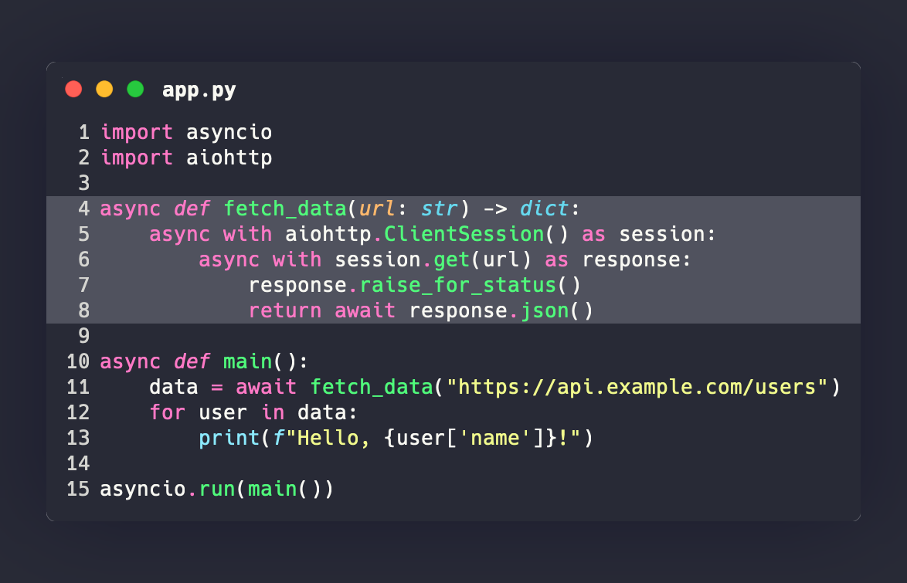
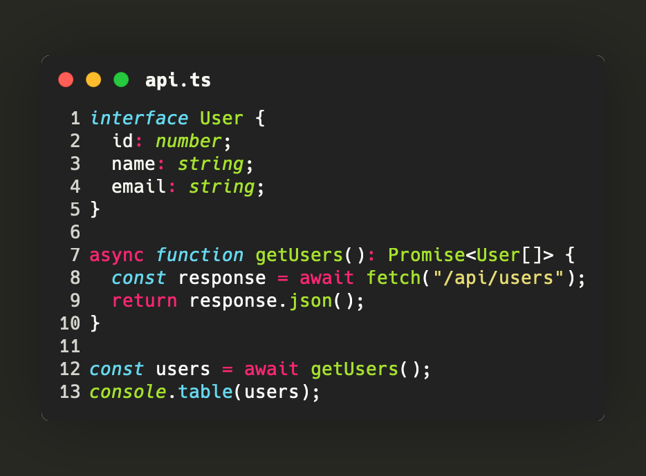
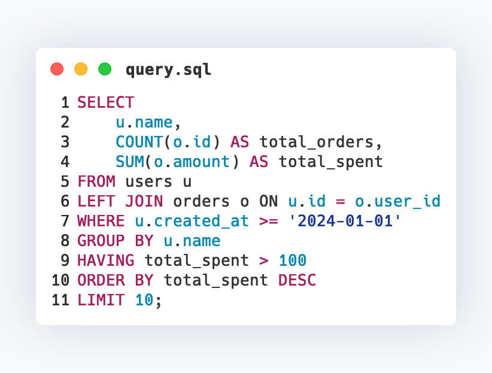

# Usage

## Basic usage

The simplest way to generate a code image:

```python
import silicate

png_bytes = silicate.generate("print('Hello!')")
```

This returns raw PNG bytes using the default settings (Python syntax, Dracula theme, Hack font at 26pt).

### Save to file

```python
silicate.to_file(
    "print('Hello!')",
    "output.png",
    language="python",
)
```

The output format is determined by the file extension (`.png`, `.jpg`, etc.).

### Write bytes to file manually

```python
png = silicate.generate("print('Hello!')")

with open("output.png", "wb") as f:
    f.write(png)
```

## Customization

### Themes

```python
# Use a specific theme
png = silicate.generate(code, theme="Nord")

# List all available themes
for theme in silicate.list_themes():
    print(theme)
```

Available themes include: `1337`, `Coldark-Cold`, `Coldark-Dark`, `DarkNeon`, `Dracula`, `GitHub`, `Monokai Extended`, `Nord`, `OneHalfDark`, `OneHalfLight`, `Solarized (dark)`, `Solarized (light)`, `Sublime Snazzy`, `TwoDark`, `Visual Studio Dark+`, `gruvbox-dark`, `gruvbox-light`, `zenburn`, and more.

Here's the same code rendered with different themes:

<table>
  <tr>
    <td align="center"><strong>Dracula</strong><br></td>
    <td align="center"><strong>Nord</strong><br></td>
  </tr>
  <tr>
    <td align="center"><strong>Monokai Extended</strong><br></td>
    <td align="center"><strong>GitHub</strong><br></td>
  </tr>
</table>

### Languages

```python
# Specify language by name or file extension
png = silicate.generate(code, language="rust")
png = silicate.generate(code, language="rs")

# List all available languages
for name, extensions in silicate.list_languages():
    print(f"{name}: {extensions}")
```

### Fonts

```python
# Use a system font
png = silicate.generate(code, font=[("Menlo", 24.0)])

# Multiple fonts (fallback chain)
png = silicate.generate(code, font=[("Fira Code", 24.0), ("Hack", 24.0)])
```

The default font is **Hack** at 26pt, which is bundled with Silicon.

### Window appearance

```python
# Window title
png = silicate.generate(code, window_title="main.py")

# Hide window controls (the red/yellow/green dots)
png = silicate.generate(code, show_window_controls=False)

# Hide line numbers
png = silicate.generate(code, show_line_numbers=False)

# Square corners
png = silicate.generate(code, round_corner=False)
```

### Background and shadow

```python
# Custom background color
png = silicate.generate(code, background="#2e3440")

# Custom shadow
png = silicate.generate(
    code,
    shadow_color="#1a1a2e",
    shadow_blur_radius=80.0,
)

# No shadow (set blur to 0 and match background)
png = silicate.generate(
    code,
    background="#282a36",
    shadow_color="#282a36",
    shadow_blur_radius=0.0,
    pad_horiz=40,
    pad_vert=40,
)
```

Colors are specified as hex strings: `#RGB`, `#RGBA`, `#RRGGBB`, or `#RRGGBBAA`.

### Line highlighting

```python
# Highlight specific lines (1-based)
png = silicate.generate(code, highlight_lines=[3, 4, 5])
```

### Padding and spacing

```python
png = silicate.generate(
    code,
    pad_horiz=40,      # Horizontal padding (default: 80)
    pad_vert=60,       # Vertical padding (default: 100)
    line_pad=4,        # Spacing between lines (default: 2)
    line_offset=10,    # Starting line number (default: 1)
    tab_width=2,       # Spaces per tab (default: 4)
)
```

## Full example

```python
import silicate

code = """\
async def fetch_data(url: str) -> dict:
    async with aiohttp.ClientSession() as session:
        async with session.get(url) as response:
            response.raise_for_status()
            return await response.json()
"""

silicate.to_file(
    code,
    "api_call.png",
    language="python",
    theme="Nord",
    font=[("Fira Code", 24.0)],
    window_title="api.py",
    highlight_lines=[4],
    background="#2e3440",
    shadow_color="#1a1a2e",
    shadow_blur_radius=60.0,
    pad_horiz=60,
    pad_vert=80,
)
```

The code above produces:


